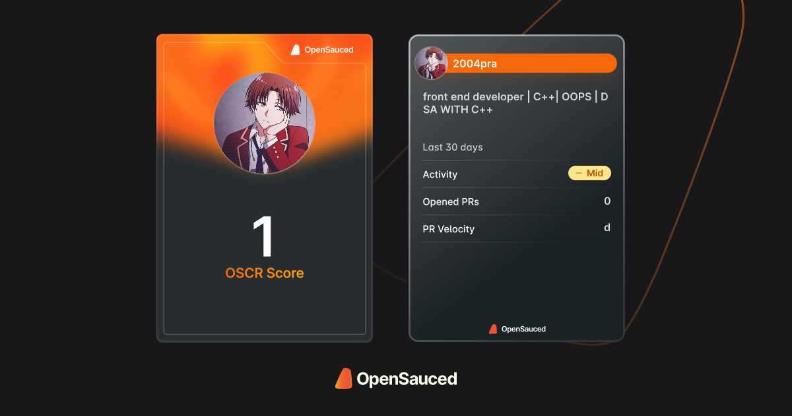

## 🌐 Socials:
          
# ✌️To the top !

 

  

# 💻 Tech Stack:
        
# 📊 GitHub Stats:

 

## 🏆 GitHub Trophies

### 🔝 Top Contributed Repo

---

<!-- Proudly created with GPRM ( https://gprm.itsvg.in ) -->
